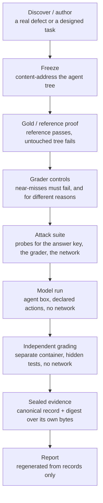

# Architecture

How an exam gets from an idea to a sealed record, and what runs where while a
model sits it. Facts here are the ones the published receipts and records carry;
where a stage is not recorded on the artifacts in this repository, this document
says so instead of describing it as proven.

## The lifecycle

**Discover or author.** A public-OSS exam starts from a real upstream issue and
its merged fix; the parent commit becomes the tree the model is given and the
fix becomes the reference solution. A VVDex-authored exam starts from a failure
mode we want observable and is designed grader-first: if the outcome cannot be
graded by a program, the exam is not built.

**Freeze.** The agent-visible tree is hashed (`frozenTreeSha256` on every
receipt in this repository) together with the parent commit and, where the
freeze was taken inside a container, the image digest. A freeze taken without a
container runtime records a null image digest rather than borrowing one, and has
to be re-frozen by a promotion pass. The exam's fingerprint is the identity every
later artifact names.

**Gold / reference proof.** The reference solution must pass the hidden grader,
the untouched tree must fail it, the grader must not be visible to the model,
and no part of the reference may appear in the tree the model is given. The
recorded outcome is on each receipt as `referencePass` and `baselineFail`. On
all five exams here: reference pass rate 1.0 over n=2, baseline fail rate 0.0
over n=2.

**Grader controls.** A set of submissions that must land on known verdicts:
untouched tree (fail), reference (pass), an incomplete fix (fail), a plausible
lookalike near-miss (fail), a planted test hook (fail), a planted reward file
(fail), and the reference again after the tampering attempts (pass). The two
wrong-but-plausible cases are required to fail for different reasons, read from
the failing test sets rather than inferred from an exit code. The case count is
per exam, and every receipt here records `distinguished: true`:
`graderControls.cases` is 7 on `public.swe.martinblech-xmltodict-issue-257`,
`vvdex.knowledge.grounded-rag-1` and `vvdex.knowledge.memory-fact-update-1`, 9
on `vvdex.browser.order-desk-1`, and 12 on `vvdex.harness.fault-recovery-1`.

**Attack suite.** Scripted probes attack the grade rather than the task:
rewriting or deleting tests, planting collection hooks, reaching for the answer
key, writing outside the allowed paths, opening the network. The exam passes
only when no probe finds a trivial exploit and the reference still passes after
the whole suite has run. Each receipt here records 10 probes, 10 blocked, 0
trivial exploits.

**Model run.** See below.

**Independent grading.** Grading happens after submission, in a separate step,
in its own container with no network. The graded tree's hash must equal the
submitted workspace's hash or the grade is voided. The model never sees the
hidden tests or the reference during a rollout.

**Sealed evidence.** The run produces one record per exam: identity, the exam's
certification state at run time, per-rollout outcomes, statistics, failure
classes, containment verdicts and integrity counts. The record seals a digest
over its own canonical bytes before it is written.

**Report.** The campaign document and the standalone reports are regenerated
from records only, and fail generation if they disagree with them.

## The model-run architecture

**The agent box.** The model works inside a container built from the exam's
frozen tree. Resource limits are on the public contract of every exam here:
`cpus: 1`, `memory: 512m`, `pids: 128`, `readOnlyRoot: true`, and a per-command
timeout. The filesystem policy is `agent-tree-only`; writable paths are declared
per exam (for the xmltodict exam, exactly `xmltodict.py`).

**Network: none.** `networkPolicy: deny` and `resourceLimits.network: "none"` on
every contract in this repository. There is no outbound network from the agent
box during a rollout, and none from the grade box during grading.

**Declared tools.** The model acts only through the actions the exam advertises.
The xmltodict record's `limits.advertisedTools` is
`list_files, read_file, write_file, edit_file, run_tests, submit`, with a step
budget (`maxSteps: 40`), a tool limit, an output-token cap and a wall-clock
limit, all recorded on the record.

**The grade box.** A separate container, no network, running the hidden grader
against the submitted workspace. Its image digest is recorded
(`certification.runtime.imageDigest`).

**The browser box.** For `vvdex.browser.order-desk-1` the web application and a
real headless Chromium run inside the model's own network-none box from a frozen
state. The model sees the page as a text snapshot with stable element references
and acts through declared browser actions: open, snapshot, click, fill, select,
press, back. The application's state, its own audit log of every mutating
request, and the engine's action ledger all sit outside the model's writable
paths, so the grader can require that every change was driven through the
application rather than written into a file.

**Harness faults.** For `vvdex.harness.fault-recovery-1` the engine applies,
inside the tool loop, a fixed schedule of faults the exam declares in advance:
transient tool errors, injected instructions, truncated writes. Nothing is
sampled; each fault is applied deterministically and recorded on the trace, and
the trace is what the grader reads. Which calls the schedule touches, and in
what order, is exam material and is not published — it is the reusable part of
this exam.

**Secrets.** `secretsPolicy: job-envelope-only` on every contract here: the box
receives what the job envelope carries and nothing from the host environment.

**Containment auditing.** Provider API lanes are contained by construction — the
provider sees only what the harness sends. Agent CLI lanes run on the host and
are audited after the run from their own session stores, for tool use,
answer-key access, cross-session memory and network use. A lane whose store
cannot be read is withheld. A lane whose CLI keeps its own host toolset with no
way to remove it is excluded as uncertifiable, which is why the Cursor Agent CLI
lane appears in no campaign in this repository. Containment is never inferred
from configuration.

## The evidence model

Four artifact kinds, in dependency order. Each one names the one below it.

1. **The certification receipt** (`exams/<examId>/certification-receipt.json`)
   — what the exam's own certification recorded, before any model ran. Every
   field is copied from evidence that already existed, and the receipt's
   `sources` block names where each field came from. A field the recorded
   evidence does not substantiate reads `"unavailable"`, never a zero.
2. **The proof descriptor** (`exams/<examId>/exam.public.json`) — what the exam
   measures in plain English, its immutable fingerprint, its runtime class, the
   categories of tool the model was offered, its limits, its ownership
   declaration and its public disclosure level. For the one exam whose
   ownership declaration names a public upstream repository and licence, a
   `contract.public.json` travels beside it with the world the model was given;
   for a VVDex-authored exam it does not, because the world is the exam.
3. **The sealed record** is the run. It carries the environment block (including
   the same fingerprint), the engine revision (`engine.gitCommit`), the
   certification block as it stood at run time, per-rollout results, statistics,
   containment verdicts, integrity counts and the harness's review of itself.
   The `recordDigest` field in the canonical bytes is sixty-four zeros; the
   digest it states ships here as
   `reports/<campaignId>/records/<evalId>.digest.txt`. The bytes themselves stay
   in the Forge, because they carry both submission-derived content and the
   grader's own verdicts, which name VVDex evaluation internals. What ships
   beside the digest is a `.canonical.WITHHELD.txt` naming the reason and a
   sanitized `.record.public.json` projection.
4. **The campaign** (`reports/<campaignId>/campaign.json`, `summary.json`, the
   PDFs) — derived from the records and nothing else. The campaign id is a
   digest over the sorted record digests, so the same records always name the
   same campaign.

The exam fingerprint is the join key across 1, 2 and 3, and across the exam's
page on the live site. If the four do not agree, the receipt describes a
different exam revision than the result. [VERIFICATION.md](VERIFICATION.md)
gives the commands.

## What this repository is not

It is not the engine and it does not run anything. `vvdex-env` — the
certification chain, the containment auditor, the verdict state machine and the
report renderer — is private, and its revision is stamped on every record as
`engine.gitCommit`. The exams' hidden tests, reference solutions, graders,
control cases and attack probes are not here either. See
[SECURITY.md](SECURITY.md).
